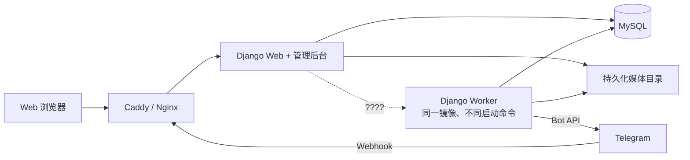

# Telegram 频道内容管理系统：调研与架构设计

> 调研日期：2026-07-10；方案修订：2026-07-11  
> 目标：用尽量少的技术组件，实现总账号/子账号、Telegram Bot 指令、频道消息发送/编辑/删除、定时与循环投递，以及完整的系统内审计。

## 0. 本轮确认的产品边界

本项目采用 **全新开发**，不 fork、不改造目标站源码。目标站只作为子账号端的页面、信息架构和操作流程基准。

同一个域名、同一套 Django 应用、同一个用户表、同一个登录入口，按账号角色进入两个工作区：

```text
同一网站
├── 子账号工作区（前台） /user/*
│   └── 以目标站当前子账号页面为视觉和交互基准
└── 主账号工作区（后台） /master/*
    └── 子账号管理、全局审计和业务总览
```

登录后的默认跳转：

- `SUB` → `/user/contents`
- `MASTER` → `/master/dashboard`
- Django 技术超级管理员 → `/system-admin/`，只供运维，不属于业务主账号

主账号和子账号不是两个项目，也不是两个前后端；它们共享认证、数据库、业务服务、Telegram Adapter、任务队列和审计系统，只是路由、菜单与数据范围不同。

项目已由用户确认进入开发和联调阶段，当前实现以本文后续确认项为准。

### 0.1 2026-07-12 已确认的内容投递规则

- 内容增加“简体/繁体”发送选项，默认简体；选择繁体时，发送前通过 `opencc-python-reimplemented` 提供的 OpenCC `s2t` 转换，数据库仍保存用户原始输入。
- 同一内容的 Operation 严格按创建顺序执行；较早的 `QUEUED/RUNNING` 任务未结束时，后续任务不能越过。
- 首次上架使用 `SEND`。已上架内容到达循环时间时使用强制 `REPLACE`：先发新批次，成功后删除旧批次。
- 已上架内容通过网页或 `/编辑` 修改后，不再原地同步编辑；统一使用强制 `REPLACE`，即先重发新消息，成功后删除旧消息。
- “我的内容”和“已下架内容”支持当前页全选及批量下架、上架或归档。
- 子账号端移除“指定消息操作”入口和路由，历史任务记录仍保留。
- `message is not modified` 视为幂等成功；任务列表提供完整 Telegram 错误详情，不再只显示截断文本。

### 0.2 2026-07-14 两阶段原子投递与整批编辑

- 新内容的第二次发送媒体改为必填；第一组和第二组都只接受图片/视频，每组最多 10 个文件。
- 第一组没有媒体时，文字本身作为第一条消息；第二组媒体始终作为第二条消息/媒体组。
- 单个频道内采用补偿式原子投递：任一阶段失败时立即删除本批次已经成功发送的消息；补偿删除不完整或网络结果未知时标记 `UNCERTAIN`，不伪装成完整失败。
- Bot 必须同时具备 `can_post_messages` 和 `can_delete_messages`，否则不执行需要补偿能力的两阶段投递。
- 循环、定时更新和已上架内容编辑都发送一个完整的新批次，保存全部新 `message_id` 后删除旧批次；新批次失败时保留旧批次。
- 编辑页的文件删除与排序只在浏览器暂存；点击“保存整批修改”后，文字、频道、媒体删除、替换和顺序在一个数据库事务中提交，并只创建一个 `REPLACE` Operation。
- 主后台提供频道链接转 Chat ID：公开频道通过 Bot API `getChat`，`t.me/c/<internal_id>/...` 直接转换为 `-100<internal_id>`；私有邀请链接使用该 Bot 已接收的 `channel_post`/转发来源识别。解析通过异步请求在当前页面完成，不跳转页面；弹窗只输出 `-100...` ID 并提供复制按钮。

### 0.3 手动重发功能下线

- 子账号内容详情页不再显示手动“重发”按钮，对应 POST 路由已删除。
- Bot `/重发` 指令及帮助入口已删除；部署迁移时取消尚未执行的历史 `COPY` 任务和待确认动作。
- 内容编辑、定时和循环更新仍使用 `REPLACE` 替换发布：先发送完整新批次，成功后删除旧批次；这属于版本替换，不是用户手动重发。
- 历史 `COPY` Operation 仅保留用于审计展示，不再创建或执行。

### 0.4 2026-07-15 定时/循环任务可视化

- 子账号新增 `/user/tasks`，只展示当前子账号自己的定时上架、循环更新、执行次数、最近执行、下一次执行和队列状态。
- 主账号新增 `/master/tasks`，展示名下全部子账号的定时/循环任务，增加子账号列，便于统一排查。
- 两个页面都提供“中止”按钮：清空内容的 `publish_at/cycle_days/cycle_time/next_run_at`，并取消仍在排队或待确认的 Scheduler 自动任务。
- 中止动作写入 `scheduled_task.stop` 审计，记录中止前后的时间配置和被取消的排队任务数量。

### 0.5 2026-07-16 Telegram 图片尺寸预处理

- 上传图片先通过 PIL 做可读性校验，损坏图片在表单阶段提示更换文件。
- 发送前对图片做 Telegram 安全副本处理：长宽比控制在 `20:1` 内，宽高和控制在 `10000` 内，输出 JPEG 目标大小低于 `10MB`。
- 极端长图/宽图自动补白后再压缩，避免 Telegram 返回 `PHOTO_INVALID_DIMENSIONS` 导致整批发送失败。
- `processed_file` 作为实际发送文件优先使用；普通图片保留原文件，只有防扫图或尺寸/大小超限时生成安全副本。

### 0.6 2026-07-17 媒体分批追加选择

- 上传和编辑页的两个媒体输入框支持分批选择：第一次选择 5 个后，再次打开文件选择器会从第 6 个继续追加，不覆盖前一批。
- 浏览器把分批选择结果合并成一个 `FileList` 后再随表单提交，后端仍按每组最多 10 个文件统一校验并保持选择顺序。
- 每个媒体组显示已选数量、连续序号和预览，并提供“一键清空本组媒体”；编辑页该按钮只清理本次新选择，已保存媒体仍通过现有媒体区的暂存删除操作管理。

### 0.7 2026-07-19 频道分配与子账号可见性

- 主账号创建或编辑子账号时，频道分配统一使用复选框，直接勾选多个频道，不再依赖原生多选框的 Shift/Ctrl 操作。
- 子账号个人中心增加“我的可用频道”，只读展示当前账号已分配的频道名称、Chat ID、用户名、连接状态及发布/编辑/下架权限。
- 个人中心、上传页和编辑页使用同一份 `UserChannelAccess` 数据范围，主账号取消分配后对应频道会同时从这些入口消失。

### 0.8 2026-07-19 下架联动中止自动任务

- 网页单条下架、批量下架和 Telegram `/下架` 确认统一清空 `publish_at/cycle_days/cycle_time/next_run_at`，下架后不再保留循环规则。
- 同时取消该内容尚未执行的 Scheduler `SEND/REPLACE` 任务并写入审计；下架的 Telegram 删除任务继续按原顺序执行。
- Worker 执行 Scheduler 任务前再次检查自动任务配置；配置已清空或内容处于下架处理中时，将旧任务标记为 `CANCELLED`，不再产生新频道消息。
- 部署迁移会清理历史下架内容遗留的自动任务配置和待执行 Scheduler 队列，解决旧数据仍显示“循环待排队”的问题。

### 0.9 2026-07-19 历史自动任务一致性巡检

- 增加幂等管理命令 `python manage.py audit_scheduled_tasks`，默认只扫描下架后残留的循环配置、失效 Scheduler 队列、孤立任务和执行中异常任务。
- 使用 `python manage.py audit_scheduled_tasks --fix` 执行确定性修复：清空下架遗留时间字段、取消尚未执行的失效任务，并为每次变化写入系统审计。
- 已经进入 `RUNNING` 的任务只列入复核清单；Worker 自身仍会在发送前根据内容状态和时间配置执行第二道拦截。
- `0007` 数据迁移自动补扫 `0006` 未覆盖的孤立/失效 Scheduler 队列；巡检命令可在部署后、故障恢复后和日常维护时重复运行。

## 1. 结论先行

建议做一个 **Django 单体应用并全新开发**，不要拆微服务，也不要在 MVP 引入 MongoDB、Redis、Kafka、Go、Java 或 PHP。

推荐栈：

| 层 | 选型 |
|---|---|
| Web/业务后台 | Django + Django Templates |
| 页面交互 | Bootstrap + HTMX/少量原生 JS + SortableJS |
| 数据库 | MySQL 8 |
| Telegram | `aiogram 3` + Bot API + Django ASGI Webhook；会话/任务状态仍存 MySQL |
| 异步与定时 | MySQL `operations` 任务表 + 同代码库单 Worker |
| 媒体 | 单机持久化目录；以后再换 S3/MinIO |
| TLS/入口 | 新部署用 Caddy；已有 Nginx 就继续用 Nginx，二选一 |
| 部署 | 单机 Docker Compose |

运行时只有一个代码库、一个数据库：



总账号和子账号不需要动态 RBAC。只做两个业务角色：

- `MASTER`：后台控制面，管理子账号、共享 Bot/频道、全局任务和审计；默认查看而不代替子账号执行业务操作。
- `SUB`：前台业务面，只管理自己的内容、被分配的频道、Telegram 管理员绑定和自己的操作记录。

技术运维使用 Django `is_superuser`，不要把业务总账号等同于 Django 超级管理员。

### 多频道、多 Bot 预留

当前虽然是“一个频道 + 一个机器人”，数据库和业务层从第一版就按以下关系实现：

```text
Bot  N ─── N Channel
```

- 一个 Bot 可以绑定多个频道；
- 一个频道可以绑定多个 Bot；
- 子账号被分配的是频道，不直接持有 Bot Token；
- 每个频道可设置主 Bot 和备用 Bot；
- 每次实际投递必须固化当时使用的 Bot，后续编辑、删除和审计都能找到原始执行者。

这样以后新增频道或给同一频道增加机器人，只需要增加绑定记录和分配关系，不修改内容、投递、审计等核心表。

---

## 2. 对目标网站的只读观察

本次只查看页面、DOM、表单动作、响应头和加载资源，没有执行上传、保存、编辑、删除、发送、上下架或绑定操作。

### 可见功能

- 个人中心：修改资料、我的内容、已下架、上传内容、绑定多个 Telegram 数字管理员 ID。
- 内容：搜索、分页、查看、编辑、删除、上架、下架、发送记录。
- 上传：文字、循环天数、每天循环时间、定时上架、多频道选择。
- 媒体：第一组允许图片/视频混排拖拽；第二组为视频组；可选“防扫图处理”。
- 日志：动作、操作者、状态、详情；能看到 `pending → success`、逐频道结果、`delete`、`text_sync`、首次上架和循环发送。
- 循环发送：先生成新批次，再删除旧批次；编辑已上架内容后也按替换发布流程重发。

### 技术线索

- `nginx/1.18.0 (Ubuntu)`。
- 日志明确写到 Celery 异步队列，因此可确认 Python/Celery。
- 服务端渲染、表单路由和 CSRF 结构高概率为 Flask/Jinja，但这是推断。
- 页面主要为原生 HTML/CSS/JS，使用同域 SortableJS 1.15.2，没有发现 React/Vue SPA。
- 上传使用 `XMLHttpRequest + multipart/form-data`。

### 值得借鉴

1. 把“内容模板”“目标频道”“每次实际投递”“Telegram 消息 ID”“任务/日志”分层。
2. 每个频道独立保存结果，允许部分成功、部分失败。
3. 发送、编辑后替换发布、旧消息清理都通过数据库任务执行，并先记录 `QUEUED`。
4. 媒体分组和排序模型适合复制。

### 不应照搬

- 目标站的“上架”是状态变更 GET：`/user/content/publish/<id>`。新系统必须使用 POST，并校验 CSRF 与幂等键。
- 发送详情不应只存长文本；要结构化保存频道、媒体组和每一个 Telegram `message_id`。
- 所有查询都必须自动附加当前账号的数据范围，不能依赖前端传入账号 ID。

完整截图和路由记录见同目录的 `site-audit/target-site-readonly-audit.md`。

---

## 3. 页面与交互复刻方案

### 3.1 子账号端：以目标站为基准重做

子账号端不重新发明后台样式，按已观察到的目标站页面重新实现：

- 浅蓝灰点阵背景；
- 居中的白色大圆角内容容器；
- 页面顶部居中标题和副标题；
- 浅蓝灰欢迎/导航条；
- 蓝色主操作、绿色新增/成功、红色下架/危险、灰色编辑；
- 内容列表桌面端三列卡片，卡片下方保持“下架/查看/编辑/删除/发送记录”的动作排列；
- 上传和编辑页保持分块表单、媒体预览、拖拽排序、上传进度；
- 上传和编辑页的频道选择使用复选框打勾形式，支持直接勾选一个或多个频道；
- 个人中心保持账号信息、账号管理、内容入口、Bot 上传设置四个区域；
- 手机端改为单列卡片和可换行按钮，不另做一套移动页面。

这里的“一致”指页面结构、视觉语言、操作位置、字段顺序、状态颜色和用户流程一致；代码、模板和样式全部重新编写，不依赖目标站源码或静态资源。

### 3.2 子账号路由

为了减少迁移后的操作习惯变化，子账号端尽量保留目标站的路由和命名：

```text
/user/profile
/user/contents
/user/tasks
/user/content/upload
/user/content/view/<id>
/user/content/edit/<id>
/user/content/logs/<id>
```

所有状态变更改成 POST：

```text
POST /user/content/<id>/publish
POST /user/content/<id>/unpublish
POST /user/content/<id>/delete
POST /user/tasks/<id>/stop
```

### 3.3 主账号端：同站点后台

主账号端继续沿用相同背景、白色容器、按钮颜色、表单和卡片规范，不套用风格完全不同的第三方 Admin 主题。

主账号导航建议为：

```text
业务总览
子账号管理
频道与 Bot
定时任务
全局任务
操作审计
账号设置
```

主账号页面：

```text
/master/dashboard
/master/subaccounts
/master/subaccounts/create
/master/subaccounts/<id>
/master/subaccounts/<id>/contents
/master/subaccounts/<id>/operations
/master/telegram
/master/tasks
/master/operations
/master/audits
/master/profile
```

主账号查看某个子账号时，页面顶部固定显示“当前查看：子账号名称”。如果以后增加代操作，必须使用显式“进入子账号视角”，并把实际主账号、目标子账号和操作结果同时写入审计；MVP 默认只查看，不代操作。

### 3.4 共用组件

两端共用一套模板组件：

```text
base.html
page_header.html
welcome_nav.html
status_badge.html
content_card.html
form_section.html
confirm_modal.html
pagination.html
operation_log.html
```

这样能保证主账号和子账号看起来属于同一个产品，同时避免复制两套 HTML/CSS。

---

## 4. GitHub 可借鉴项目

截至调研日，没有发现一个成熟仓库能直接覆盖“Web 总后台 + 子账号 + Bot 指令 + 已发布频道消息 CRUD/重发 + 完整审计”。适合拆开借鉴，不建议直接作为成品上线。

| 项目 | 技术/许可证 | 适合借鉴 | 关键缺口 |
|---|---|---|---|
| [Post4U](https://github.com/ShadowSlayer03/Post4U-Schedule-Social-Media-Posts) | Python、FastAPI、MongoDB、APScheduler、Reflex；MIT | Web 编辑器、媒体上传、持久调度、逐平台失败重试、保存 `message_id` | 单 API Key/单频道；Telegram 只发送；无已发消息编辑/删除、子账号、审计或 Bot 指令 |
| [channel-admin-bot](https://github.com/vlymar1/channel-admin-bot) | Python、aiogram、SQLAlchemy、PostgreSQL；MIT | Telegram FSM、文章草稿 CRUD、管理员/内容管理员角色 | 源码中编辑/删除只处理本地草稿；发布后不保存频道 `message_id`；无 Web、调度和完整审计 |
| [Aiogram-Bot-Template](https://github.com/UznetDev/Aiogram-Bot-Template) | Python、aiogram、MySQL；MIT | 主管理员创建管理员、权限位、管理员只管自己添加的频道 | 不是文章后台；无已发布内容 CRUD、Web 和审计；Cython 部分不必照搬 |
| [Zam](https://github.com/AminAlam/Zam) | Python、PostgreSQL、Docker；MIT | 持久排期、优先队列、管理员/投稿 Bot 分离、统计和测试结构 | 强绑定 X/Twitter 内容；无通用子账号和已发消息 CRUD |
| [Postiz](https://github.com/gitroomhq/postiz-app) | TypeScript、Next.js/NestJS、PostgreSQL、Redis/Temporal；AGPL-3.0 | 内容日历、团队协作、媒体编辑、排期 UI | 对本项目明显过重；非 Python；部署组件多；不适合作为代码底座 |

补充：

- [ConnectingEveryCorner/post-bot](https://github.com/ConnectingEveryCorner/post-bot) 可参考可复用消息资源、URL 按钮、SQLite/Docker 和中文交互。
- [affirmbot](https://github.com/iwatkot/affirmbot) 可参考管理员/审核员与投稿审批，但项目已归档。
- [telegram-bot-channel-manager](https://github.com/SezarSec/telegram-bot-channel-manager) 确实保存各频道 `message_id` 并调用 `deleteMessage`，但代码量小、能力不完整，不宜做底座。

建议组合借鉴：

- Post4U：媒体、调度、逐频道/逐平台投递状态；
- channel-admin-bot：Telegram 命令和多步骤交互；
- Aiogram-Bot-Template：主/子账号权限思路；
- 自己实现统一的 Telegram Adapter：`send/edit/delete/copy/forward`。

---

## 5. Telegram 官方能力边界

### 必需管理员权限

机器人加入频道后至少检查：

- `can_post_messages`
- `can_edit_messages`
- `can_delete_messages`

绑定时用 `getMe`、`getChat`、`getChatMember` 实际验证，不能只保存一个频道 ID。

### 删除限制

Bot API 的 `deleteMessage` 只允许删除发送不足 48 小时的消息；`deleteMessages` 一次可提交 1–100 个 ID，也受同样限制。

系统应保存 `sent_at` 和 `deletable_until`。超过窗口时，前端显示“Telegram 侧已不可删除”，不能把本地归档伪装成远端删除成功。

### 编辑方法

- 文本：`editMessageText`
- 媒体说明：`editMessageCaption`
- 媒体：`editMessageMedia`
- 按钮：`editMessageReplyMarkup`

相册需要保存全部消息 ID，不能只保存第一条。`chat_id` 应使用 64 位整数。

### 替换发布语义

- `copyMessage/copyMessages`：生成新消息，不展示来源。
- `forwardMessage/forwardMessages`：保留来源；受保护内容不能转发。

产品上建议定义：

> 产品不暴露手动 copy/重发入口；“替换发布”专用于内容编辑、定时或循环更新，先发新批次，成功后再删除旧批次。

### 历史与审计边界

纯 Bot API 没有通用的频道历史拉取接口，也不能保证收到 Telegram 客户端中人工删除产生的完整更新。系统只能完整审计：

1. 经过本系统发起的动作；
2. 机器人接入后收到的 `channel_post`、`edited_channel_post` 等更新；
3. 用户手工输入消息链接/ID 后执行的动作。

如果未来要求“完整抓取历史和频道管理员操作日志”，才考虑 MTProto/用户账号方案；不要放进 MVP。

官方参考：

- [Bot API](https://core.telegram.org/bots/api)
- [deleteMessage](https://core.telegram.org/bots/api#deletemessage)
- [copyMessage](https://core.telegram.org/bots/api#copymessage)
- [forwardMessage](https://core.telegram.org/bots/api#forwardmessage)
- [ChatMemberAdministrator](https://core.telegram.org/bots/api#chatmemberadministrator)

---

## 6. 业务模块

### 总账号

- 总账号是后台控制账号，不作为普通内容归属账号使用。
- 创建、编辑、停用、恢复和重置子账号。
- 给子账号分配可用频道和 Telegram Bot。
- 查看所有子账号的内容数量、运行状态、发送结果、异常和审计。
- 管理共享 Bot、频道池和频道权限检查。
- MVP 默认只能查看子账号业务数据，不能以子账号身份直接发送/删除，避免操作者混淆。
- 后续若需要代操作，使用显式“进入子账号视角”，审计同时记录实际总账号、目标子账号和动作结果。

### 子账号

- 子账号就是目标站所展示的“前台操作账号”。
- 管理自己的内容和媒体。
- 从被分配频道中选择一个或多个目标频道。
- 发布、编辑后替换发布、下架、删除。
- 设置首次定时发布、循环间隔/时间。
- 绑定允许向 Bot 发管理指令的 Telegram 数字用户 ID。
- 查看自己的投递记录和审计。

### Telegram 私聊命令

建议只在 Bot 私聊中接收管理指令，避免频道匿名身份无法追溯。

```text
/upload                 上传媒体并生成草稿
/publish <内容编号>     上架/发送
/unpublish <内容编号>   下架并尝试删除远端消息
/edit <内容编号>        编辑后发布新批次，成功后删除旧批次
/cancel                 取消当前会话
```

删除、下架必须有二次确认；确认令牌绑定 Telegram `from.id`，几分钟后失效。

Telegram 身份不要按 username 授权。后台生成一次性深链：

```text
t.me/<bot_username>?start=<10分钟有效的一次性token>
```

由 Web 登录态和真实 `from.id` 完成绑定。

---

## 7. 数据模型

为了保持简单，MVP 直接把“账号”作为一个自定义 Django User，不再额外创建组织/租户层。

### `users`

```text
id
parent_id nullable          # SUB 指向 MASTER，只允许一层
role: MASTER | SUB
username
password_hash
display_name
status: ACTIVE | DISABLED
last_login_at
created_at
```

### `telegram_bots`

```text
id
public_id UUID
telegram_bot_id BIGINT
username
token_ciphertext            # 从第一版开始加密入库
webhook_secret_ciphertext
status
last_verified_at
```

即使第一版只有一个 Bot，Token 也按多 Bot 模式加密入库，服务器环境变量只保存统一加密主密钥，避免以后从单环境变量迁移到多 Bot 时重构。

### `telegram_channels`

```text
id
telegram_chat_id BIGINT
username nullable
title
description
photo
status: ACTIVE | DEGRADED | DISCONNECTED
route_policy: PRIMARY_ONLY | FAILOVER | EXPLICIT
created_at
```

频道和 Bot 不直接一对多关联，使用中间表。

### `telegram_bot_channel_bindings`

```text
id
bot_id
channel_id
priority                   # 1 为主 Bot，数值越大优先级越低
status: ACTIVE | DEGRADED | DISABLED
can_post_messages
can_edit_messages
can_delete_messages
can_change_info
rights_json
last_verified_at
UNIQUE(bot_id, channel_id)
UNIQUE(channel_id, priority)
```

### `user_channels`

```text
user_id
channel_id
can_publish
can_edit
can_delete
```

### `telegram_user_links`

```text
user_id
bot_id
telegram_user_id BIGINT
status
linked_at
```

### `contents`

```text
id
owner_user_id
code                       # 面向用户的内容编号
title
text
status: DRAFT | PUBLISHED | UNPUBLISHING | UNPUBLISHED | ARCHIVED
publish_at nullable
cycle_days nullable
cycle_time nullable
next_run_at nullable
anti_scan_enabled
version
created_by / updated_by
created_at / updated_at / deleted_at
```

业务删除默认软删除，避免审计链和 Telegram 消息映射丢失。

### `content_files`

```text
id
content_id
group_no: 1 | 2
sort_index
media_type
storage_path
processed_path nullable
sha256
mime
size
telegram_file_ids_json     # bot_id -> file_id
```

### `content_channels`

```text
content_id
channel_id
```

### `deliveries`

每次发送到一个频道是一条 Delivery：

```text
id
content_id
channel_id
bot_channel_binding_id     # 本次实际使用的 Bot/频道绑定
bot_id_snapshot            # 防止绑定关系以后变化后无法追溯
operation_id
generation                 # 循环重发批次
status: PENDING | PARTIAL | ACTIVE | DELETE_PENDING | DELETED | FAILED | UNKNOWN
content_version
sent_at
deletable_until
replaces_delivery_id nullable
```

### `delivery_messages`

```text
id
delivery_id
group_no
sort_index
telegram_message_id BIGINT
sent_by_bot_id
media_group_id nullable
payload_snapshot_json
status: SENT | EDITED | DELETED | UNKNOWN
last_edited_at
deleted_at
```

`UNIQUE(channel_id, telegram_message_id)` 应由 Delivery 关联后保证。相册的每条消息都必须有一行。由于 Telegram `file_id` 只能由生成它的 Bot 复用，媒体表继续按 `bot_id -> file_id` 保存映射。

### `operations`

既是业务动作，也是 MySQL 任务队列：

```text
id UUID/ULID
owner_user_id
actor_type: WEB_USER | TELEGRAM_USER | SYSTEM
actor_id
source: WEB | TELEGRAM | SCHEDULER | SYSTEM
action: SEND | EDIT | DELETE | COPY | FORWARD | REPLACE | SYNC_TEXT
target_type / target_id
request_json
idempotency_key
state: PENDING_CONFIRM | QUEUED | RUNNING | SUCCEEDED | PARTIAL | FAILED | UNCERTAIN | CANCELLED
attempt_count
available_at
locked_by / locked_until
telegram_error_code / telegram_error_text
created_at / started_at / finished_at
```

`UNIQUE(owner_user_id, idempotency_key)` 防止 Web 重复点击和任务重复入队。

### `telegram_pending_actions`

```text
id
bot_id
owner_user_id
telegram_user_id
content_id
action
token unique
payload_json
expires_at
status: PENDING | CONFIRMED | CANCELLED | EXPIRED
```

?? Telegram ???????????????? Bot????? ID????????

### `telegram_updates`

```text
bot_id
update_id BIGINT
body_json
state
received_at / processed_at
UNIQUE(bot_id, update_id)
```

### `audit_events`

```text
id ULID
owner_user_id
actor_type / actor_id
source
action
object_type / object_id
operation_id nullable
request_id
before_json / after_json
outcome: ACCEPTED | SUCCESS | PARTIAL | FAILED | DENIED
ip / user_agent
error_code
created_at
```

审计表在业务代码中只追加，不提供修改/删除页面。日志中不得写入密码、完整 Bot Token、Session Cookie 或 Webhook Secret。

“每个行为”建议定义为所有登录/失败登录和所有业务状态变更；普通页面浏览放 Web access log，不要把每次翻页都塞进业务审计。

---

## 8. 关键执行流程

### Bot 路由

内容只选择目标 `channel_id`，不把 Bot 写死在内容模板中。创建投递任务时再解析 `telegram_bot_channel_bindings`：

1. `EXPLICIT`：使用主账号或高级操作中明确选择的 Bot；
2. `PRIMARY_ONLY`：使用该频道 `priority=1` 的主 Bot；
3. `FAILOVER`：主 Bot 在调用前已失效，或 Telegram 明确返回 Token/权限错误时，才尝试备用 Bot；
4. 网络超时产生 `UNCERTAIN` 时禁止切换备用 Bot，避免主 Bot 已经发出、备用 Bot又重复发送。

每个 Delivery 固化 `bot_channel_binding_id` 和 `bot_id_snapshot`。编辑、删除首先使用原投递 Bot；原 Bot 不可用时，只有备用 Bot 已验证拥有对应权限才允许接管。涉及媒体 `file_id` 时，不同 Bot 不能直接复用，需要使用本地原文件重新上传。

同一频道绑定多个 Bot 后，它们可能都收到相同的频道更新。原始 Update 仍按 `(bot_id, update_id)` 去重，业务消息再按 `(channel_id, telegram_message_id)` 幂等 upsert，避免同一频道消息生成多份记录。

### 统一入口

Web 按钮和 Telegram 指令必须调用同一个 Application Service：

```text
鉴权与数据范围
  → 参数/Telegram 权限/48小时窗口校验
  → MySQL 事务：创建 Operation + Audit(ACCEPTED)
  → 返回 operation_id
  → Worker 领取任务
  → 调 Telegram API
  → 更新 Delivery/Message/Operation
  → Audit(SUCCESS/PARTIAL/FAILED)
```

不要在 Web view 和 Bot handler 中各写一份发送逻辑。

### 循环/替换发布

按频道独立执行：

1. 发送新批次并保存全部新 `message_id`。
2. 该频道新批次全部成功后，才把它设为 `ACTIVE`。
3. 再对该频道旧批次发起删除。
4. 某频道新批次失败时保留旧批次，其他频道不受影响。

这比“先删旧、再发新”安全，也能正确表达部分成功。

### 编辑后替换发布

1. 保存内容新版本和变更前快照。
2. 创建带 `force_resend=true` 的 `REPLACE` 任务。
3. 对每个频道先发送新 Delivery 并保存全部 Message ID。
4. 仅在该频道新批次发送成功后删除旧 Delivery；失败时保留旧批次。
5. 逐频道记录成功、部分成功或失败；旧 `SYNC_TEXT` 任务仅用于兼容历史队列，并把 `message is not modified` 视为幂等成功。

### 下架/删除

- 本地状态先变为 `UNPUBLISHING`，不是立刻显示“已删除”。
- Worker 尝试删除每个活动 Delivery 的所有消息。
- 超过 48 小时或权限丢失时，记录远端残留并显示原因。
- 本地内容可归档，但 Telegram 远端状态必须单独展示。

### 超时和重复发送

Telegram 发送 API 不接受业务幂等键。存在“Telegram 已成功，但调用方没收到响应”的情况。

- `SEND/COPY` 网络超时后标记 `UNCERTAIN`，不要自动盲重试。
- 等待 Webhook 更新对账或人工确认。
- `429` 按 `retry_after` 重排。
- `5xx` 可指数退避；编辑/删除比新发送更适合安全重试。

---

## 9. MySQL Worker

一个 Worker 同时扫描到期内容和领取操作任务：

```sql
SELECT id
FROM operations
WHERE state = 'QUEUED'
  AND available_at <= NOW()
  AND NOT EXISTS (
      SELECT 1 FROM operations earlier
      WHERE earlier.owner_user_id = operations.owner_user_id
        AND earlier.target_type = operations.target_type
        AND earlier.target_id = operations.target_id
        AND earlier.created_at < operations.created_at
        AND earlier.state IN ('QUEUED', 'RUNNING')
  )
ORDER BY created_at
LIMIT 1
FOR UPDATE SKIP LOCKED;
```

领取后写入租约 `locked_by/locked_until`，提交事务，再调用 Telegram。进程崩溃后，过期租约可重新领取。

优点：

- 不部署 Redis/RabbitMQ/Kafka。
- 任务、状态、审计都在同一个 MySQL 中，事务边界清晰。
- 对低用户量和少量频道足够。

出现下列情况后再加 Redis + Celery/RQ：

- 多台 Worker；
- 大量定时任务；
- 队列需要秒级高吞吐；
- 任务类型明显扩张。

Kafka 只适合多个独立系统高吞吐消费事件，本项目无需使用。

---

## 10. 安全与运维

1. 同源后台使用 Django Session、CSRF、`Secure + HttpOnly + SameSite=Lax` Cookie，不引入 JWT。
2. 密码使用 Django 支持的强哈希；新子账号首次登录强制改密码。
3. 所有资源查询从当前 Session 推导 `owner_user_id`，不信任请求体中的账号 ID。
4. Bot Token 若入库，使用 AES-GCM/Fernet 加密；页面只显示末几位，日志统一脱敏。
5. 每个 Bot Webhook 使用随机 `public_id` 路径并校验 `X-Telegram-Bot-Api-Secret-Token`。
6. 绑定频道和操作前定期检查管理员权限；401 标记 Token 失效，403 标记频道 `DEGRADED`。
7. 所有状态变更只用 POST/PATCH/DELETE，并校验 CSRF；禁止状态变更 GET。
8. 数据库存 UTC，页面按 Asia/Shanghai 展示。
9. 每天备份 MySQL 和媒体目录，并定期做恢复验证。
10. JSON 日志统一带 `request_id`、`operation_id`、`owner_user_id`。
11. Telegram HTML 仅允许受控标签，避免把任意 HTML 原样渲染回后台。

---

## 11. MVP 顺序

### 第一阶段：核心闭环

- 总账号/子账号登录、创建、停用、重置、数据隔离。
- Bot/频道多对多绑定、主/备用路由、中央频道池和权限校验；首期只配置当前一个频道和一个 Bot。
- Telegram 管理员一次性绑定。
- 文本、单图、基础相册上传与排序。
- Web 与 Bot 私聊发送、编辑和 48 小时内删除。
- 保存全部 `chat_id + message_id`。
- Operations、MySQL Worker、逐频道结果、完整审计。
- Docker Compose、TLS、备份。

### 第二阶段：复制目标站体验

- 两阶段媒体组。
- 定时上架、按天循环、替换发布。
- 多频道批量投递与部分失败处理。
- 图片防扫处理。
- 文本同步、文件增删与内容版本。
- 审计导出、TOTP、失败告警。

### 暂不做

- MTProto/Telethon 用户号登录。
- 完整频道历史抓取。
- 微服务。
- MongoDB、Redis、Kafka。
- Vue/React 独立前端。
- Kubernetes。

这套方案在保持单体和少组件的同时，已经覆盖目标站的核心能力，并修正了其状态变更 GET、长文本发送日志和消息 ID 结构化不足等问题。

---

## 12. 开工前确认清单

只有以下内容确认后才开始编码：

- [ ] 全部重新开发，只参考目标站页面和流程，不依赖其源码。
- [ ] 一个网站、一个登录入口、一个 Django 应用和一个数据库。
- [ ] 子账号使用 `/user/*` 前台，页面以目标站子账号端为基准重做。
- [ ] 主账号使用 `/master/*` 后台，风格与子账号端保持一致。
- [ ] 主账号负责子账号生命周期、频道/Bot 分配、全局任务和审计。
- [ ] 主账号默认查看而不代操作；代操作以后再加。
- [ ] 当前可先配置一个频道和一个 Bot，但底层从第一版采用 Bot↔频道多对多绑定。
- [ ] 每个频道支持主 Bot、备用 Bot 和路由策略；每次投递固化实际 Bot。
- [ ] 子账号只选择被分配的频道，默认不接触 Bot Token，也不把 Bot 写死在内容模板中。
- [ ] Django + MySQL + aiogram + MySQL Worker，不上 Redis/MongoDB/Kafka。
- [ ] 第一阶段先完成账号、内容、发送/编辑/删除、消息 ID 映射、任务和审计。
- [ ] 第二阶段再完成两阶段媒体组、循环替换、定时、防扫图和高级报表。
- [ ] “完整审计”定义为完整记录本系统内动作；Telegram 客户端中的人工历史操作不承诺完整捕获。```text
??ID                  ?? Telegram ???? ID
/?? <????>         ??/??
/?? <????>         ?????????????
/?? <????>         ????????? copy ??
/?? <????> <??>  ???????????
/?? <????>         ???????????
/?? <???>           ?? 5 ?????????
/??                    ?????????
```text
同一网站
├── 子账号工作区（前台） /user/*
│   └── 以目标站当前子账号页面为视觉和交互基准
└── 主账号工作区（后台） /master/*
    └── 子账号管理、全局审计和业务总览
```

登录后的默认跳转：

- `SUB` → `/user/contents`
- `MASTER` → `/master/dashboard`
- Django 技术超级管理员 → `/system-admin/`，只供运维，不属于业务主账号

主账号和子账号不是两个项目，也不是两个前后端；它们共享认证、数据库、业务服务、Telegram Adapter、任务队列和审计系统，只是路由、菜单与数据范围不同。

项目已由用户确认进入开发和联调阶段，当前实现以本文 0.1 节确认项为准。

## 1. 结论先行

建议做一个 **Django 单体应用并全新开发**，不要拆微服务，也不要在 MVP 引入 MongoDB、Redis、Kafka、Go、Java 或 PHP。

推荐栈：

| 层 | 选型 |
|---|---|
| Web/业务后台 | Django + Django Templates |
| 页面交互 | Bootstrap + HTMX/少量原生 JS + SortableJS |
| 数据库 | MySQL 8 |
| Telegram | `aiogram 3` + Bot API + Django ASGI Webhook；会话/任务状态仍存 MySQL |
| 异步与定时 | MySQL `operations` 任务表 + 同代码库单 Worker |
| 媒体 | 单机持久化目录；以后再换 S3/MinIO |
| TLS/入口 | 新部署用 Caddy；已有 Nginx 就继续用 Nginx，二选一 |
| 部署 | 单机 Docker Compose |

运行时只有一个代码库、一个数据库：


总账号和子账号不需要动态 RBAC。只做两个业务角色：

- `MASTER`：后台控制面，管理子账号、共享 Bot/频道、全局任务和审计；默认查看而不代替子账号执行业务操作。
- `SUB`：前台业务面，只管理自己的内容、被分配的频道、Telegram 管理员绑定和自己的操作记录。

技术运维使用 Django `is_superuser`，不要把业务总账号等同于 Django 超级管理员。

### 多频道、多 Bot 预留

当前虽然是“一个频道 + 一个机器人”，数据库和业务层从第一版就按以下关系实现：

```text
Bot  N ─── N Channel
```

- 一个 Bot 可以绑定多个频道；
- 一个频道可以绑定多个 Bot；
- 子账号被分配的是频道，不直接持有 Bot Token；
- 每个频道可设置主 Bot 和备用 Bot；
- 每次实际投递必须固化当时使用的 Bot，后续编辑、删除和审计都能找到原始执行者。

这样以后新增频道或给同一频道增加机器人，只需要增加绑定记录和分配关系，不修改内容、投递、审计等核心表。

---

## 2. 对目标网站的只读观察

本次只查看页面、DOM、表单动作、响应头和加载资源，没有执行上传、保存、编辑、删除、发送、上下架或绑定操作。

### 可见功能

- 个人中心：修改资料、我的内容、已下架、上传内容、绑定多个 Telegram 数字管理员 ID。
- 内容：搜索、分页、查看、编辑、删除、上架、下架、发送记录。
- 上传：文字、循环天数、每天循环时间、定时上架、多频道选择。
- 媒体：第一组允许图片/视频混排拖拽；第二组为视频组；可选“防扫图处理”。
- 日志：动作、操作者、状态、详情；能看到 `pending → success`、逐频道结果、`delete`、`text_sync`、首次上架和循环发送。
- 循环发送：先生成新批次，再删除旧批次；编辑已上架内容后也按替换发布流程重发。

### 技术线索

- `nginx/1.18.0 (Ubuntu)`。
- 日志明确写到 Celery 异步队列，因此可确认 Python/Celery。
- 服务端渲染、表单路由和 CSRF 结构高概率为 Flask/Jinja，但这是推断。
- 页面主要为原生 HTML/CSS/JS，使用同域 SortableJS 1.15.2，没有发现 React/Vue SPA。
- 上传使用 `XMLHttpRequest + multipart/form-data`。

### 值得借鉴

1. 把“内容模板”“目标频道”“每次实际投递”“Telegram 消息 ID”“任务/日志”分层。
2. 每个频道独立保存结果，允许部分成功、部分失败。
3. 发送、编辑后替换发布、旧消息清理都通过数据库任务执行，并先记录 `QUEUED`。
4. 媒体分组和排序模型适合复制。

### 不应照搬

- 目标站的“上架”是状态变更 GET：`/user/content/publish/<id>`。新系统必须使用 POST，并校验 CSRF 与幂等键。
- 发送详情不应只存长文本；要结构化保存频道、媒体组和每一个 Telegram `message_id`。
- 所有查询都必须自动附加当前账号的数据范围，不能依赖前端传入账号 ID。

完整截图和路由记录见同目录的 `site-audit/target-site-readonly-audit.md`。

---

## 3. 页面与交互复刻方案

### 3.1 子账号端：以目标站为基准重做

子账号端不重新发明后台样式，按已观察到的目标站页面重新实现：

- 浅蓝灰点阵背景；
- 居中的白色大圆角内容容器；
- 页面顶部居中标题和副标题；
- 浅蓝灰欢迎/导航条；
- 蓝色主操作、绿色新增/成功、红色下架/危险、灰色编辑；
- 内容列表桌面端三列卡片，卡片下方保持“下架/查看/编辑/删除/发送记录”的动作排列；
- 上传和编辑页保持分块表单、媒体预览、拖拽排序、上传进度；
- 上传和编辑页的频道选择使用复选框打勾形式，支持直接勾选一个或多个频道；
- 个人中心保持账号信息、账号管理、内容入口、Bot 上传设置四个区域；
- 手机端改为单列卡片和可换行按钮，不另做一套移动页面。

这里的“一致”指页面结构、视觉语言、操作位置、字段顺序、状态颜色和用户流程一致；代码、模板和样式全部重新编写，不依赖目标站源码或静态资源。

### 3.2 子账号路由

为了减少迁移后的操作习惯变化，子账号端尽量保留目标站的路由和命名：

```text
/user/profile
/user/contents
/user/tasks
/user/content/upload
/user/content/view/<id>
/user/content/edit/<id>
/user/content/logs/<id>
```

所有状态变更改成 POST：

```text
POST /user/content/<id>/publish
POST /user/content/<id>/unpublish
POST /user/content/<id>/delete
POST /user/tasks/<id>/stop
```

### 3.3 主账号端：同站点后台

主账号端继续沿用相同背景、白色容器、按钮颜色、表单和卡片规范，不套用风格完全不同的第三方 Admin 主题。

主账号导航建议为：

```text
业务总览
子账号管理
频道与 Bot
定时任务
全局任务
操作审计
账号设置
```

主账号页面：

```text
/master/dashboard
/master/subaccounts
/master/subaccounts/create
/master/subaccounts/<id>
/master/subaccounts/<id>/contents
/master/subaccounts/<id>/operations
/master/telegram
/master/tasks
/master/operations
/master/audits
/master/profile
```

主账号查看某个子账号时，页面顶部固定显示“当前查看：子账号名称”。如果以后增加代操作，必须使用显式“进入子账号视角”，并把实际主账号、目标子账号和操作结果同时写入审计；MVP 默认只查看，不代操作。

### 3.4 共用组件

两端共用一套模板组件：

```text
base.html
page_header.html
welcome_nav.html
status_badge.html
content_card.html
form_section.html
confirm_modal.html
pagination.html
operation_log.html
```

这样能保证主账号和子账号看起来属于同一个产品，同时避免复制两套 HTML/CSS。

---

## 4. GitHub 可借鉴项目

截至调研日，没有发现一个成熟仓库能直接覆盖“Web 总后台 + 子账号 + Bot 指令 + 已发布频道消息 CRUD/重发 + 完整审计”。适合拆开借鉴，不建议直接作为成品上线。

| 项目 | 技术/许可证 | 适合借鉴 | 关键缺口 |
|---|---|---|---|
| [Post4U](https://github.com/ShadowSlayer03/Post4U-Schedule-Social-Media-Posts) | Python、FastAPI、MongoDB、APScheduler、Reflex；MIT | Web 编辑器、媒体上传、持久调度、逐平台失败重试、保存 `message_id` | 单 API Key/单频道；Telegram 只发送；无已发消息编辑/删除、子账号、审计或 Bot 指令 |
| [channel-admin-bot](https://github.com/vlymar1/channel-admin-bot) | Python、aiogram、SQLAlchemy、PostgreSQL；MIT | Telegram FSM、文章草稿 CRUD、管理员/内容管理员角色 | 源码中编辑/删除只处理本地草稿；发布后不保存频道 `message_id`；无 Web、调度和完整审计 |
| [Aiogram-Bot-Template](https://github.com/UznetDev/Aiogram-Bot-Template) | Python、aiogram、MySQL；MIT | 主管理员创建管理员、权限位、管理员只管自己添加的频道 | 不是文章后台；无已发布内容 CRUD、Web 和审计；Cython 部分不必照搬 |
| [Zam](https://github.com/AminAlam/Zam) | Python、PostgreSQL、Docker；MIT | 持久排期、优先队列、管理员/投稿 Bot 分离、统计和测试结构 | 强绑定 X/Twitter 内容；无通用子账号和已发消息 CRUD |
| [Postiz](https://github.com/gitroomhq/postiz-app) | TypeScript、Next.js/NestJS、PostgreSQL、Redis/Temporal；AGPL-3.0 | 内容日历、团队协作、媒体编辑、排期 UI | 对本项目明显过重；非 Python；部署组件多；不适合作为代码底座 |

补充：

- [ConnectingEveryCorner/post-bot](https://github.com/ConnectingEveryCorner/post-bot) 可参考可复用消息资源、URL 按钮、SQLite/Docker 和中文交互。
- [affirmbot](https://github.com/iwatkot/affirmbot) 可参考管理员/审核员与投稿审批，但项目已归档。
- [telegram-bot-channel-manager](https://github.com/SezarSec/telegram-bot-channel-manager) 确实保存各频道 `message_id` 并调用 `deleteMessage`，但代码量小、能力不完整，不宜做底座。

建议组合借鉴：

- Post4U：媒体、调度、逐频道/逐平台投递状态；
- channel-admin-bot：Telegram 命令和多步骤交互；
- Aiogram-Bot-Template：主/子账号权限思路；
- 自己实现统一的 Telegram Adapter：`send/edit/delete/copy/forward`。

---

## 5. Telegram 官方能力边界

### 必需管理员权限

机器人加入频道后至少检查：

- `can_post_messages`
- `can_edit_messages`
- `can_delete_messages`

绑定时用 `getMe`、`getChat`、`getChatMember` 实际验证，不能只保存一个频道 ID。

### 删除限制

Bot API 的 `deleteMessage` 只允许删除发送不足 48 小时的消息；`deleteMessages` 一次可提交 1–100 个 ID，也受同样限制。

系统应保存 `sent_at` 和 `deletable_until`。超过窗口时，前端显示“Telegram 侧已不可删除”，不能把本地归档伪装成远端删除成功。

### 编辑方法

- 文本：`editMessageText`
- 媒体说明：`editMessageCaption`
- 媒体：`editMessageMedia`
- 按钮：`editMessageReplyMarkup`

相册需要保存全部消息 ID，不能只保存第一条。`chat_id` 应使用 64 位整数。

### 替换发布语义

- `copyMessage/copyMessages`：生成新消息，不展示来源。
- `forwardMessage/forwardMessages`：保留来源；受保护内容不能转发。

产品上建议定义：

> 产品不暴露手动 copy/重发入口；“替换发布”专用于内容编辑、定时或循环更新，先发新批次，成功后再删除旧批次。

### 历史与审计边界

纯 Bot API 没有通用的频道历史拉取接口，也不能保证收到 Telegram 客户端中人工删除产生的完整更新。系统只能完整审计：

1. 经过本系统发起的动作；
2. 机器人接入后收到的 `channel_post`、`edited_channel_post` 等更新；
3. 用户手工输入消息链接/ID 后执行的动作。

如果未来要求“完整抓取历史和频道管理员操作日志”，才考虑 MTProto/用户账号方案；不要放进 MVP。

官方参考：

- [Bot API](https://core.telegram.org/bots/api)
- [deleteMessage](https://core.telegram.org/bots/api#deletemessage)
- [copyMessage](https://core.telegram.org/bots/api#copymessage)
- [forwardMessage](https://core.telegram.org/bots/api#forwardmessage)
- [ChatMemberAdministrator](https://core.telegram.org/bots/api#chatmemberadministrator)

---

## 6. 业务模块

### 总账号

- 总账号是后台控制账号，不作为普通内容归属账号使用。
- 创建、编辑、停用、恢复和重置子账号。
- 给子账号分配可用频道和 Telegram Bot。
- 查看所有子账号的内容数量、运行状态、发送结果、异常和审计。
- 管理共享 Bot、频道池和频道权限检查。
- MVP 默认只能查看子账号业务数据，不能以子账号身份直接发送/删除，避免操作者混淆。
- 后续若需要代操作，使用显式“进入子账号视角”，审计同时记录实际总账号、目标子账号和动作结果。

### 子账号

- 子账号就是目标站所展示的“前台操作账号”。
- 管理自己的内容和媒体。
- 从被分配频道中选择一个或多个目标频道。
- 发布、编辑后替换发布、下架、删除。
- 设置首次定时发布、循环间隔/时间。
- 绑定允许向 Bot 发管理指令的 Telegram 数字用户 ID。
- 查看自己的投递记录和审计。

### Telegram 私聊命令

建议只在 Bot 私聊中接收管理指令，避免频道匿名身份无法追溯。

```text
/upload                 上传媒体并生成草稿
/publish <内容编号>     上架/发送
/unpublish <内容编号>   下架并尝试删除远端消息
/edit <内容编号>        编辑后发布新批次，成功后删除旧批次
/cancel                 取消当前会话
```

删除、下架必须有二次确认；确认令牌绑定 Telegram `from.id`，几分钟后失效。

Telegram 身份不要按 username 授权。后台生成一次性深链：

```text
t.me/<bot_username>?start=<10分钟有效的一次性token>
```

由 Web 登录态和真实 `from.id` 完成绑定。

---

## 7. 数据模型

为了保持简单，MVP 直接把“账号”作为一个自定义 Django User，不再额外创建组织/租户层。

### `users`

```text
id
parent_id nullable          # SUB 指向 MASTER，只允许一层
role: MASTER | SUB
username
password_hash
display_name
status: ACTIVE | DISABLED
last_login_at
created_at
```

### `telegram_bots`

```text
id
public_id UUID
telegram_bot_id BIGINT
username
token_ciphertext            # 从第一版开始加密入库
webhook_secret_ciphertext
status
last_verified_at
```

即使第一版只有一个 Bot，Token 也按多 Bot 模式加密入库，服务器环境变量只保存统一加密主密钥，避免以后从单环境变量迁移到多 Bot 时重构。

### `telegram_channels`

```text
id
telegram_chat_id BIGINT
username nullable
title
status: ACTIVE | DEGRADED | DISCONNECTED
route_policy: PRIMARY_ONLY | FAILOVER | EXPLICIT
created_at
```

频道和 Bot 不直接一对多关联，使用中间表。

### `telegram_bot_channel_bindings`

```text
id
bot_id
channel_id
priority                   # 1 为主 Bot，数值越大优先级越低
status: ACTIVE | DEGRADED | DISABLED
can_post_messages
can_edit_messages
can_delete_messages
rights_json
last_verified_at
UNIQUE(bot_id, channel_id)
UNIQUE(channel_id, priority)
```

### `user_channels`

```text
user_id
channel_id
can_publish
can_edit
can_delete
```

### `telegram_user_links`

```text
user_id
bot_id
telegram_user_id BIGINT
status
linked_at
```

### `contents`

```text
id
owner_user_id
code                       # 面向用户的内容编号
title
text
status: DRAFT | PUBLISHED | UNPUBLISHING | UNPUBLISHED | ARCHIVED
publish_at nullable
cycle_days nullable
cycle_time nullable
next_run_at nullable
anti_scan_enabled
version
created_by / updated_by
created_at / updated_at / deleted_at
```

业务删除默认软删除，避免审计链和 Telegram 消息映射丢失。

### `content_files`

```text
id
content_id
group_no: 1 | 2
sort_index
media_type
storage_path
processed_path nullable
sha256
mime
size
telegram_file_ids_json     # bot_id -> file_id
```

### `content_channels`

```text
content_id
channel_id
```

### `deliveries`

每次发送到一个频道是一条 Delivery：

```text
id
content_id
channel_id
bot_channel_binding_id     # 本次实际使用的 Bot/频道绑定
bot_id_snapshot            # 防止绑定关系以后变化后无法追溯
operation_id
generation                 # 循环重发批次
status: PENDING | PARTIAL | ACTIVE | DELETE_PENDING | DELETED | FAILED | UNKNOWN
content_version
sent_at
deletable_until
replaces_delivery_id nullable
```

### `delivery_messages`

```text
id
delivery_id
group_no
sort_index
telegram_message_id BIGINT
sent_by_bot_id
media_group_id nullable
payload_snapshot_json
status: SENT | EDITED | DELETED | UNKNOWN
last_edited_at
deleted_at
```

`UNIQUE(channel_id, telegram_message_id)` 应由 Delivery 关联后保证。相册的每条消息都必须有一行。由于 Telegram `file_id` 只能由生成它的 Bot 复用，媒体表继续按 `bot_id -> file_id` 保存映射。

### `operations`

既是业务动作，也是 MySQL 任务队列：

```text
id UUID/ULID
owner_user_id
actor_type: WEB_USER | TELEGRAM_USER | SYSTEM
actor_id
source: WEB | TELEGRAM | SCHEDULER | SYSTEM
action: SEND | EDIT | DELETE | COPY | FORWARD | REPLACE | SYNC_TEXT
target_type / target_id
request_json
idempotency_key
state: PENDING_CONFIRM | QUEUED | RUNNING | SUCCEEDED | PARTIAL | FAILED | UNCERTAIN | CANCELLED
attempt_count
available_at
locked_by / locked_until
telegram_error_code / telegram_error_text
created_at / started_at / finished_at
```

`UNIQUE(owner_user_id, idempotency_key)` 防止 Web 重复点击和任务重复入队。

### `telegram_updates`

```text
bot_id
update_id BIGINT
body_json
state
received_at / processed_at
UNIQUE(bot_id, update_id)
```

### `audit_events`

```text
id ULID
owner_user_id
actor_type / actor_id
source
action
object_type / object_id
operation_id nullable
request_id
before_json / after_json
outcome: ACCEPTED | SUCCESS | PARTIAL | FAILED | DENIED
ip / user_agent
error_code
created_at
```

审计表在业务代码中只追加，不提供修改/删除页面。日志中不得写入密码、完整 Bot Token、Session Cookie 或 Webhook Secret。

“每个行为”建议定义为所有登录/失败登录和所有业务状态变更；普通页面浏览放 Web access log，不要把每次翻页都塞进业务审计。

---

## 8. 关键执行流程

### Bot 路由

内容只选择目标 `channel_id`，不把 Bot 写死在内容模板中。创建投递任务时再解析 `telegram_bot_channel_bindings`：

1. `EXPLICIT`：使用主账号或高级操作中明确选择的 Bot；
2. `PRIMARY_ONLY`：使用该频道 `priority=1` 的主 Bot；
3. `FAILOVER`：主 Bot 在调用前已失效，或 Telegram 明确返回 Token/权限错误时，才尝试备用 Bot；
4. 网络超时产生 `UNCERTAIN` 时禁止切换备用 Bot，避免主 Bot 已经发出、备用 Bot又重复发送。

每个 Delivery 固化 `bot_channel_binding_id` 和 `bot_id_snapshot`。编辑、删除首先使用原投递 Bot；原 Bot 不可用时，只有备用 Bot 已验证拥有对应权限才允许接管。涉及媒体 `file_id` 时，不同 Bot 不能直接复用，需要使用本地原文件重新上传。

同一频道绑定多个 Bot 后，它们可能都收到相同的频道更新。原始 Update 仍按 `(bot_id, update_id)` 去重，业务消息再按 `(channel_id, telegram_message_id)` 幂等 upsert，避免同一频道消息生成多份记录。

### 统一入口

Web 按钮和 Telegram 指令必须调用同一个 Application Service：

```text
鉴权与数据范围
  → 参数/Telegram 权限/48小时窗口校验
  → MySQL 事务：创建 Operation + Audit(ACCEPTED)
  → 返回 operation_id
  → Worker 领取任务
  → 调 Telegram API
  → 更新 Delivery/Message/Operation
  → Audit(SUCCESS/PARTIAL/FAILED)
```

不要在 Web view 和 Bot handler 中各写一份发送逻辑。

### 循环/替换发布

按频道独立执行：

1. 发送新批次并保存全部新 `message_id`。
2. 该频道新批次全部成功后，才把它设为 `ACTIVE`。
3. 再对该频道旧批次发起删除。
4. 某频道新批次失败时保留旧批次，其他频道不受影响。

这比“先删旧、再发新”安全，也能正确表达部分成功。

### 编辑后替换发布

1. 保存内容新版本和变更前快照。
2. 创建带 `force_resend=true` 的 `REPLACE` 任务。
3. 对每个频道先发送新 Delivery 并保存全部 Message ID。
4. 仅在该频道新批次发送成功后删除旧 Delivery；失败时保留旧批次。
5. 逐频道记录成功、部分成功或失败；旧 `SYNC_TEXT` 任务仅用于兼容历史队列，并把 `message is not modified` 视为幂等成功。

### 下架/删除

- 本地状态先变为 `UNPUBLISHING`，不是立刻显示“已删除”。
- Worker 尝试删除每个活动 Delivery 的所有消息。
- 超过 48 小时或权限丢失时，记录远端残留并显示原因。
- 本地内容可归档，但 Telegram 远端状态必须单独展示。

### 超时和重复发送

Telegram 发送 API 不接受业务幂等键。存在“Telegram 已成功，但调用方没收到响应”的情况。

- `SEND/COPY` 网络超时后标记 `UNCERTAIN`，不要自动盲重试。
- 等待 Webhook 更新对账或人工确认。
- `429` 按 `retry_after` 重排。
- `5xx` 可指数退避；编辑/删除比新发送更适合安全重试。

---

## 9. MySQL Worker

一个 Worker 同时扫描到期内容和领取操作任务：

```sql
SELECT id
FROM operations
WHERE state = 'QUEUED'
  AND available_at <= NOW()
  AND NOT EXISTS (
      SELECT 1 FROM operations earlier
      WHERE earlier.owner_user_id = operations.owner_user_id
        AND earlier.target_type = operations.target_type
        AND earlier.target_id = operations.target_id
        AND earlier.created_at < operations.created_at
        AND earlier.state IN ('QUEUED', 'RUNNING')
  )
ORDER BY created_at
LIMIT 1
FOR UPDATE SKIP LOCKED;
```

领取后写入租约 `locked_by/locked_until`，提交事务，再调用 Telegram。进程崩溃后，过期租约可重新领取。

优点：

- 不部署 Redis/RabbitMQ/Kafka。
- 任务、状态、审计都在同一个 MySQL 中，事务边界清晰。
- 对低用户量和少量频道足够。

出现下列情况后再加 Redis + Celery/RQ：

- 多台 Worker；
- 大量定时任务；
- 队列需要秒级高吞吐；
- 任务类型明显扩张。

Kafka 只适合多个独立系统高吞吐消费事件，本项目无需使用。

---

## 10. 安全与运维

1. 同源后台使用 Django Session、CSRF、`Secure + HttpOnly + SameSite=Lax` Cookie，不引入 JWT。
2. 密码使用 Django 支持的强哈希；新子账号首次登录强制改密码。
3. 所有资源查询从当前 Session 推导 `owner_user_id`，不信任请求体中的账号 ID。
4. Bot Token 若入库，使用 AES-GCM/Fernet 加密；页面只显示末几位，日志统一脱敏。
5. 每个 Bot Webhook 使用随机 `public_id` 路径并校验 `X-Telegram-Bot-Api-Secret-Token`。
6. 绑定频道和操作前定期检查管理员权限；401 标记 Token 失效，403 标记频道 `DEGRADED`。
7. 所有状态变更只用 POST/PATCH/DELETE，并校验 CSRF；禁止状态变更 GET。
8. 数据库存 UTC，页面按 Asia/Shanghai 展示。
9. 每天备份 MySQL 和媒体目录，并定期做恢复验证。
10. JSON 日志统一带 `request_id`、`operation_id`、`owner_user_id`。
11. Telegram HTML 仅允许受控标签，避免把任意 HTML 原样渲染回后台。

---

## 11. MVP 顺序

### 第一阶段：核心闭环

- 总账号/子账号登录、创建、停用、重置、数据隔离。
- Bot/频道多对多绑定、主/备用路由、中央频道池和权限校验；首期只配置当前一个频道和一个 Bot。
- Telegram 管理员一次性绑定。
- 文本、单图、基础相册上传与排序。
- Web 与 Bot 私聊发送、编辑和 48 小时内删除。
- 保存全部 `chat_id + message_id`。
- Operations、MySQL Worker、逐频道结果、完整审计。
- Docker Compose、TLS、备份。

### 第二阶段：复制目标站体验

- 两阶段媒体组。
- 定时上架、按天循环、替换发布。
- 多频道批量投递与部分失败处理。
- 图片防扫处理。
- 文本同步、文件增删与内容版本。
- 审计导出、TOTP、失败告警。

### 暂不做

- MTProto/Telethon 用户号登录。
- 完整频道历史抓取。
- 微服务。
- MongoDB、Redis、Kafka。
- Vue/React 独立前端。
- Kubernetes。

这套方案在保持单体和少组件的同时，已经覆盖目标站的核心能力，并修正了其状态变更 GET、长文本发送日志和消息 ID 结构化不足等问题。

---

## 12. 开工前确认清单

只有以下内容确认后才开始编码：

- [ ] 全部重新开发，只参考目标站页面和流程，不依赖其源码。
- [ ] 一个网站、一个登录入口、一个 Django 应用和一个数据库。
- [ ] 子账号使用 `/user/*` 前台，页面以目标站子账号端为基准重做。
- [ ] 主账号使用 `/master/*` 后台，风格与子账号端保持一致。
- [ ] 主账号负责子账号生命周期、频道/Bot 分配、全局任务和审计。
- [ ] 主账号默认查看而不代操作；代操作以后再加。
- [ ] 当前可先配置一个频道和一个 Bot，但底层从第一版采用 Bot↔频道多对多绑定。
- [ ] 每个频道支持主 Bot、备用 Bot 和路由策略；每次投递固化实际 Bot。
- [ ] 子账号只选择被分配的频道，默认不接触 Bot Token，也不把 Bot 写死在内容模板中。
- [ ] Django + MySQL + aiogram + MySQL Worker，不上 Redis/MongoDB/Kafka。
- [ ] 第一阶段先完成账号、内容、发送/编辑/删除、消息 ID 映射、任务和审计。
- [ ] 第二阶段再完成两阶段媒体组、循环替换、定时、防扫图和高级报表。
- [ ] “完整审计”定义为完整记录本系统内动作；Telegram 客户端中的人工历史操作不承诺完整捕获。
